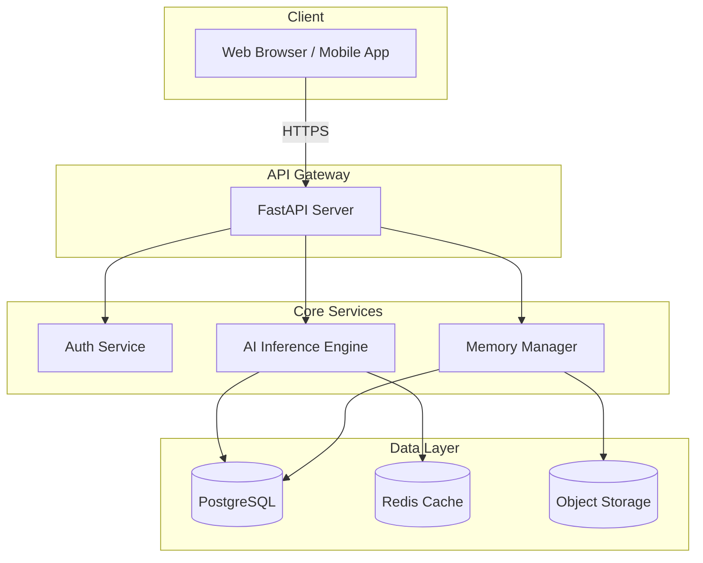
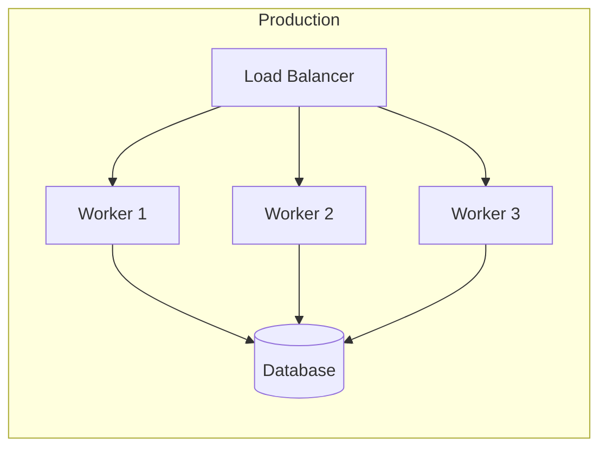

# Architecture

This page describes the high-level architecture of the OpenMIA platform.

---

## System Overview

---

## Component Descriptions

### API Gateway

The FastAPI-based gateway handles all incoming HTTP requests, performs authentication via JWT tokens, and routes requests to the appropriate internal service.

### AI Inference Engine

The core intelligence layer. It loads and serves transformer-based models for:

- **Natural Language Understanding** — intent classification, entity extraction
- **Multimodal Processing** — vision + language fusion
- **Memory-Augmented Generation** — context-aware response generation

### Memory Manager

Handles long-term and short-term memory storage:

- **Short-term**: Redis-backed session context
- **Long-term**: PostgreSQL with vector similarity search

---

## Deployment Topology

| Component      | Scaling Strategy   |
| -------------- | ------------------ |
| API Workers    | Horizontal (Gunicorn) |
| Inference      | GPU-bound, vertical  |
| Database       | Primary + Read Replicas |
| Cache          | Redis Cluster        |

---

## Security

- All external communication over **TLS 1.3**
- API keys rotated every 90 days
- Rate limiting: 100 req/min per API key
- Input sanitization on all endpoints

!!! warning "Production Checklist"
    Before deploying to production, ensure all environment variables are set
    and secrets are stored in a secure vault (e.g., GitHub Secrets, HashiCorp Vault).
